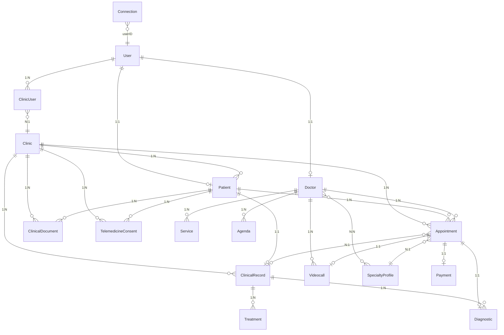

# Auditoría Técnica Completa - HeyDoctor Backend

**Fecha:** 2026-03-15  
**Plataforma:** Strapi 4.22.1 | PostgreSQL | Railway  
**Dominio:** https://api.heydoctor.health

---

## 1. ARQUITECTURA GENERAL

### 1.1 Estructura del Proyecto

```
api-backend-heydoctor/
├── config/                 # Configuración Strapi
│   ├── database.js        # PostgreSQL
│   ├── server.js          # Host, port, proxy
│   ├── middlewares.js     # Stack de middlewares
│   ├── plugins.js         # Upload, GraphQL, transformer
│   ├── api.js             # REST config
│   └── functions/         # Websockets, Sentry, Redis
├── src/
│   ├── api/               # 28 content-types + APIs
│   │   ├── appointment/   # Citas/consultas
│   │   ├── clinical-record/
│   │   ├── clinical-document/
│   │   ├── consultation/  # Controlador custom (start, join, status)
│   │   ├── connection/    # WebSocket presence
│   │   ├── custom-auth/   # Login/register custom
│   │   ├── encryption/   # Diffie-Hellman
│   │   ├── secure-file/   # Descarga segura + cifrado
│   │   ├── telemedicine-consent/
│   │   ├── videocall/     # Room metadata
│   │   ├── webrtc/        # ICE servers (TURN/STUN)
│   │   └── ...
│   ├── components/        # profile.languages, profile.experience
│   ├── middlewares/       # health, sentry, rate-limit, tenant-resolver
│   ├── policies/          # tenant-resolver
│   ├── providers/         # upload-encrypted-cloudinary
│   ├── utils/             # audit-logger, file-encryption, tenant-scope
│   ├── extensions/        # users-permissions (user schema)
│   └── index.js           # Bootstrap
├── modules/               # Lógica de dominio
│   ├── audit/             # Event listeners → audit-log
│   ├── clinical/          # Event listeners
│   ├── consultations/     # Service + Controller
│   ├── core/models/       # Consultation, Patient, Document
│   ├── events/            # eventBus (EventEmitter)
│   └── media/             # Event listeners
├── db/                    # Pool pg (raw SQL)
├── controllers/           # auditoriaController (legacy)
├── scripts/               # migrateDefaultClinic
├── railway.json
└── nixpacks.toml
```

### 1.2 Módulos Principales

| Módulo | Responsabilidad |
|--------|-----------------|
| **consultations** | Ciclo de vida: start, doctorJoin, patientJoin, transitionStatus |
| **audit** | DOCUMENT_SIGNED, CONSULTATION_STARTED, IMAGE_CAPTURED → audit-log |
| **media** | IMAGE_CAPTURED → adjuntar imágenes a appointment.files |
| **clinical** | Listeners para timeline/registro clínico |
| **eventBus** | EventEmitter para desacoplar dominio |

### 1.3 Servicios Externos

| Servicio | Uso |
|----------|-----|
| **Cloudinary** | Upload de archivos (con cifrado opcional) |
| **Redis** | Cache (doctor, specialty-profile), WebSocket adapter |
| **PostgreSQL** | Base de datos principal |
| **Sentry** | Monitoreo de errores |
| **Expo** | Push notifications |
| **TURN/STUN** | WebRTC (turn.heydoctor.health, Twilio) |
| **Payku** | Pasarela de pagos (webhook) |

### 1.4 Plugins Strapi

- @strapi/plugin-documentation
- @strapi/plugin-graphql
- @strapi/plugin-i18n
- @strapi/plugin-users-permissions
- @strapi/provider-upload-cloudinary (custom: upload-encrypted-cloudinary)
- @surunnuage/strapi-plugin-expo-notifications
- strapi-content-type-explorer
- strapi-plugin-graphs-builder
- strapi-plugin-import-export-entries
- strapi-plugin-transformer

---

## 2. MODELO DE DATOS

### 2.1 Content-Types (30 entidades)

| Content-Type | Tipo | Descripción |
|--------------|------|-------------|
| user (extended) | collection | Usuario auth + doctor/patient |
| doctor | collection | Perfil médico, specialty_profiles, agenda |
| patient | collection | Perfil paciente, clinical_record |
| clinic | collection | Multi-tenant, slug, logo |
| clinic-user | collection | Relación user-clinic-role |
| appointment | collection | Cita, status, videocall, payment, diagnostic |
| clinical-record | collection | Historia clínica, treatments, diagnostics |
| clinical-document | collection | PDFs/informes, patient, appointment |
| telemedicine-consent | collection | Consentimiento telemedicina |
| audit-log | collection | Trail de auditoría |
| videocall | collection | room_id, doctor, patient, appointment |
| connection | collection | socketID, userID, isConnected |
| message | collection | Chat (user, message) |
| diagnostic | collection | Diagnóstico por cita |
| treatment | collection | Tratamiento por clinical_record |
| medication | collection | Medicamentos |
| specialty-profile | collection | Especialidad + precios |
| service | collection | Servicios del doctor |
| service-setting | collection | Configuración |
| agenda | collection | Disponibilidad |
| payment | collection | Pago por cita |
| payment-webhook | collection | Log webhooks Payku |
| review | collection | Reseñas |
| notification | collection | Notificaciones |
| country, language | collection | Catálogos |
| cie-10-code | collection | Códigos CIE-10 |
| doctor-application | collection | Solicitudes de registro |
| signup-request | collection | Flujo registro doctores |
| immediate-attention | collection | Atención inmediata |
| encryption | collection | Claves Diffie-Hellman |

### 2.2 Relaciones Principales

```
User (1) ──► (1) Doctor
User (1) ──► (1) Patient
User (1) ──► (N) ClinicUser ──► (1) Clinic

Clinic (1) ──► (N) Patient, Appointment, ClinicalRecord, ClinicalDocument, TelemedicineConsent

Patient (1) ──► (1) ClinicalRecord
Patient (1) ──► (N) Appointment
Patient (1) ──► (N) TelemedicineConsent
Patient (1) ──► (N) ClinicalDocument

Doctor (1) ──► (N) Appointment, Videocall, Service, Agenda, Review
Doctor (N) ◄──► (N) SpecialtyProfile

Appointment (1) ──► (1) Videocall, Payment, Diagnostic
Appointment (1) ──► (1) ClinicalRecord (opcional)
Appointment (N) ◄── (1) SpecialtyProfile

ClinicalRecord (1) ──► (N) Treatment, Diagnostic
```

### 2.3 Posibles Inconsistencias

| Problema | Descripción |
|----------|-------------|
| **message** | Solo `user` y `message`; no hay relación con appointment/consultation. Chat genérico, no por consulta. |
| **favorite_doctors** | En patient: `oneToMany` a doctor sin `mappedBy`; puede generar tabla intermedia no deseada. |
| **connection.userID** | biginteger; en otros modelos user_id es integer. Verificar compatibilidad. |
| **audit-log** | user_id, patient_id como integer; no hay FK a user/patient. |
| **clinical-document** | Sin relación explícita a clinical-record. |

### 2.4 Normalización

- **Clinic** como eje multi-tenant: patient, appointment, clinical_record, clinical_document, telemedicine_consent tienen `clinic`.
- **Videocall, Payment, Diagnostic** no tienen `clinic` directo; se obtiene vía appointment.
- **Audit-log** no tiene clinic; solo user_id, patient_id, metadata.

---

## 3. API

### 3.1 Endpoints Custom (no CRUD estándar)

| Método | Ruta | Handler | Auth |
|--------|------|---------|------|
| POST | /api/custom-auth/login | custom-auth.login | No |
| POST | /api/custom-auth/register | custom-auth.register | No |
| GET | /api/webrtc/ice-servers | ice-servers.getIceServers | No |
| GET | /api/secure-file/files/:type/:filename | secure-file.download | Sí |
| POST | /api/consultations/:id/start | consultation.start | Sí |
| POST | /api/consultations/:id/doctor-join | consultation.doctorJoin | Sí |
| POST | /api/consultations/:id/patient-join | consultation.patientJoin | Sí |
| PATCH | /api/consultations/:id/status | consultation.transitionStatus | Sí |
| GET | /api/patients/:id/medical-record | patient.medicalRecord | Sí |
| GET | /_health | health middleware | No |

### 3.2 Rutas con tenant-resolver

- clinical-record (find, findOne, create, update, delete)
- consultation (todas)
- patient.medicalRecord
- appointment, patient (vía withClinicFilter en controller)

### 3.3 Middlewares (orden)

1. global::health
2. global::sentry
3. global::rate-limit
4. global::tenant-resolver
5. strapi::errors, security, cors, logger, query, body, session, favicon, public

### 3.4 Políticas

- **tenant-resolver**: Resuelve clinicId desde clinic-user. Si `requireClinic` y no hay clínica → 401.

### 3.5 Rate Limit

- POST: /api/doctor-applications, /api/auth/local, /api/custom-auth/*, /api/payment-webhooks → 30 req/min
- GET: /api/webrtc/ice-servers → 60 req/min
- **Almacenamiento:** memoria (no Redis). En múltiples instancias no se comparte.

---

## 4. DEPENDENCIAS

### 4.1 package.json (resumen)

| Categoría | Paquetes |
|-----------|----------|
| Strapi core | @strapi/strapi, plugins |
| Comunicación | socket.io, @socket.io/redis-adapter, @socket.io/sticky |
| Base de datos | pg |
| Cache/Redis | ioredis |
| Auth | jsonwebtoken |
| HTTP | axios |
| Utilidades | dotenv, into-stream, uuid, pdfkit, qrcode, web-push |
| Monitoreo | @sentry/node |
| Push | @surunnuage/strapi-plugin-expo-notifications |

### 4.2 Dependencias Faltantes / Riesgo ERR_MODULE_NOT_FOUND

- **uuid, pdfkit, qrcode, web-push**: Añadidos explícitamente para evitar errores en Railway.
- chat-sockets: eliminado (legacy).

### 4.3 Dependencias Innecesarias (candidatas a revisar)

- **strapi-plugin-graphs-builder**: Engine node 12–16; puede dar warnings con Node 20.
- **react, react-dom, react-router-dom, styled-components**: Usados por admin/plugins; necesarios para build.

---

## 5. SEGURIDAD

### 5.1 JWT

- Plugin users-permissions: JWT para API REST.
- WebSockets: Verificación JWT en `io.use()` con `jsonwebtoken`.
- Secretos: `JWT_SECRET`, `ADMIN_JWT_SECRET`, `API_TOKEN_SALT` desde env.

### 5.2 Permisos

- Permisos por rol en Strapi (Authenticated, Public, etc.).
- **doctor-application.create**: Público (formulario for-doctors).
- **Bootstrap**: Asigna permiso create a Public para doctor-application.

### 5.3 Exposición de Endpoints

| Endpoint | Expuesto | Notas |
|----------|----------|-------|
| /api/custom-auth/login, register | Público | Rate limited |
| /api/webrtc/ice-servers | Público | Credenciales TURN en env |
| /api/doctor-applications (create) | Público | Rate limited |
| /api/payment-webhooks | Público | Validar IP en webhook |
| /_health | Público | Solo status |

### 5.4 Cifrado

- **Archivos**: AES-256-GCM con FILE_ENCRYPTION_KEY (64 hex).
- **Diffie-Hellman**: Para intercambio de claves en encryption API.

---

## 6. TELEMEDICINA

### 6.1 Calls (Videollamadas)

| Componente | Implementación |
|------------|----------------|
| **Videocall** | Content-type con room_id, doctor, patient, appointment |
| **WebRTC** | ICE servers vía /api/webrtc/ice-servers (STUN Google, TURN propio, Twilio) |
| **Consultation** | start, doctorJoin, patientJoin, transitionStatus |
| **Agora** | No hay integración Agora en el backend |

La videollamada real ocurre en el frontend (WebRTC P2P o TURN). El backend gestiona:
- Metadatos de sala (videocall)
- ICE servers
- Ciclo de vida de la consulta

### 6.2 Chat

| Componente | Estado |
|------------|--------|
| **message** | Content-type con user, message. CRUD estándar. |
| **connection** | WebSocket presence (userID, socketID). Usado para notificar "usuario en línea". |
El chat actual es el CRUD de `message` con relación a appointment. WebSockets para presencia vía `config/functions/websockets.js` (Redis adapter en producción).

### 6.3 Connection

- Tabla `connections`: userID, socketID, isConnected.
- WebSockets: JWT auth, evento `join` para registrar conexión.
- Redis adapter en producción para escalar WebSockets.

### 6.4 Agora Token Service

**No existe.** El backend no genera tokens Agora. Se usa WebRTC con TURN/STUN (coturn, Twilio).

---

## 7. DOCUMENTOS CLÍNICOS

### 7.1 clinical-record

- Historia clínica: patient, observations, backgrounds, treatments, diagnostics.
- Multi-tenant: clinic.
- Rutas con tenant-resolver.
- auditLogger en controller para accesos.

### 7.2 clinical-document

- Documentos (PDFs, informes) ligados a patient y/o appointment.
- document_type, file (media).
- Sin políticas custom; permisos vía Strapi.

### 7.3 audit-logs

- action, user_id, patient_id, ip_address, user_agent, metadata.
- Creados por eventBus (DOCUMENT_SIGNED, CONSULTATION_STARTED, IMAGE_CAPTURED).
- auditLogger en secure-file, clinical-record, patient.

### 7.4 telemedicine-consent

- patient, appointment, consented_at, ip_address.
- clinic para multi-tenant.

---

## 8. BASE DE DATOS

### 8.1 PostgreSQL

```javascript
// config/database.js
connection: {
  host: env("DATABASE_HOST"),
  port: env.int("DATABASE_PORT"),
  database: env("DATABASE_NAME"),
  user: env("DATABASE_USERNAME"),
  password: env("DATABASE_PASSWORD"),
  ssl: env.bool("DATABASE_SSL") ? { rejectUnauthorized: false } : false,
}
```

### 8.2 Variables de Entorno

- DATABASE_HOST, DATABASE_PORT, DATABASE_NAME, DATABASE_USERNAME, DATABASE_PASSWORD, DATABASE_SSL

### 8.3 Migraciones

- **migrateDefaultClinic.js**: Crea clínica por defecto, asigna usuarios, actualiza clinic_id en tablas.
- No hay sistema de migraciones tipo Knex/Sequelize; Strapi sincroniza schema.

### 8.4 Integridad

- Relaciones definidas en schemas.
- Algunas tablas sin clinic_id inicial; la migración los rellena.

---

## 9. INFRAESTRUCTURA

### 9.1 Railway

| Aspecto | Configuración |
|---------|---------------|
| Build | NIXPACKS, npm ci && npm run build |
| Start | npm run start |
| Healthcheck | /_health, timeout 300s |
| Restart | ON_FAILURE, max 10 |

### 9.2 nixpacks.toml

- Node 20
- npm ci, npm run build, npm run start

### 9.3 Healthcheck

- Middleware `global::health` responde GET /_health con `{ status: "ok" }`.

---

## 10. ERRORES POTENCIALES

| Tipo | Detalle |
|------|---------|
| **Import roto** | encryptionService requiere `../../utils/encryption` pero el archivo está en `src/api/utils/encryption.js`. Ruta correcta: `../../utils/encryption` desde `src/api/encryption/services/` → `src/api/utils/encryption`. ✅ OK |
| chat-sockets | Eliminado (legacy). |
| **Rate limit** | Path `/api/doctor-applications` vs Strapi puede usar `/api/doctor-applications` (plural). Verificar. |
| **Redis** | Sin REDIS_URL, redis-cache retorna null; doctor/specialty-profile usan cache condicional. |
| **FILE_ENCRYPTION_KEY** | Sin ella, isEncryptionEnabled()=false; upload sin cifrado. |

---

## 11. ESCALABILIDAD

### 11.1 Miles de Usuarios

| Aspecto | Estado |
|----------|--------|
| **DB** | PostgreSQL escalable; índices por Strapi. |
| **WebSockets** | Redis adapter para múltiples instancias. |
| **Rate limit** | En memoria; no escala horizontalmente. |
| **Cache** | Redis opcional; sin él más carga en DB. |

### 11.2 Múltiples Clínicas

- Modelo multi-tenant con `clinic`.
- tenant-resolver y withClinicFilter aíslan datos por clínica.
- Migración para asignar clinic_id a datos legacy.

### 11.3 Múltiples Doctores

- Doctor como entidad separada.
- Agenda, services, specialty_profiles por doctor.
- Sin cuellos de botella evidentes en el diseño.

### 11.4 Recomendaciones de Escalabilidad

1. Rate limit con Redis para múltiples instancias.
2. Índices en clinic_id, user_id, patient_id en tablas grandes.
3. Paginación estricta en listados.
4. CDN para archivos estáticos/Cloudinary.

---

## 12. REPORTE FINAL

### PROBLEMAS DETECTADOS

| # | Problema | Severidad |
|---|----------|-----------|
| 1 | chat-sockets eliminado | Resuelto |
| 2 | Rate limit en memoria; no escala con múltiples instancias | Media |
| 3 | message sin relación a appointment; chat no por consulta | Media |
| 4 | favorite_doctors en patient sin mappedBy | Baja |
| 5 | audit-log sin clinic; difícil filtrar por clínica | Baja |
| 6 | No hay Agora token service (si se requiere Agora) | Info |
| 7 | clinical-document sin relación a clinical-record | Baja |

### RIESGOS

| Riesgo | Probabilidad | Impacto | Mitigación |
|--------|--------------|---------|------------|
| ERR_MODULE_NOT_FOUND en Railway | Media | Alto | Dependencias explícitas (uuid, pdfkit, etc.) |
| Rate limit bypass con múltiples IPs | Baja | Medio | Redis + límites por usuario |
| Exposición de datos entre clínicas | Baja | Alto | Revisar políticas y tenant-resolver |
| Falta de Redis en producción | Media | Medio | WebSockets sin escalar; cache deshabilitado |
| FILE_ENCRYPTION_KEY no configurado | Media | Medio | Archivos sin cifrado en reposo |

### MEJORAS RECOMENDADAS

1. **Corto plazo**
   - chat-sockets eliminado.
   - Mover rate limit a Redis.
   - Añadir clinic a audit-log o metadata.

2. **Medio plazo**
   - Relacionar message con appointment para chat por consulta.
   - Corregir favorite_doctors (mappedBy o estructura).
   - Índices en clinic_id, created_at en tablas grandes.

3. **Largo plazo**
   - Migraciones versionadas (ej. node-pg-migrate).
   - Métricas y APM (Sentry ya está).
   - Tests E2E para flujo de consulta.

### NIVEL DE MADUREZ DEL BACKEND

**7.0 / 10**

| Criterio | Puntuación | Comentario |
|----------|------------|------------|
| Arquitectura | 8 | Estructura clara, módulos, eventBus |
| Modelo de datos | 7 | Multi-tenant, algunas inconsistencias |
| API | 7.5 | CRUD + custom endpoints, tenant-resolver |
| Seguridad | 7 | JWT, rate limit, cifrado opcional |
| Telemedicina | 6.5 | WebRTC/TURN, consultation lifecycle; chat básico |
| Documentos clínicos | 7.5 | clinical-record, audit, consent |
| Infraestructura | 8 | Railway, healthcheck, nixpacks |
| Escalabilidad | 6 | Redis opcional, rate limit en memoria |
| Mantenibilidad | 7 | Código legible, algo de legacy |

**Resumen:** Backend sólido para producción con buenas bases. Rate limit con Redis, chat-sockets eliminado.

---

## ANEXO: Diagrama de Relaciones (Mermaid)


